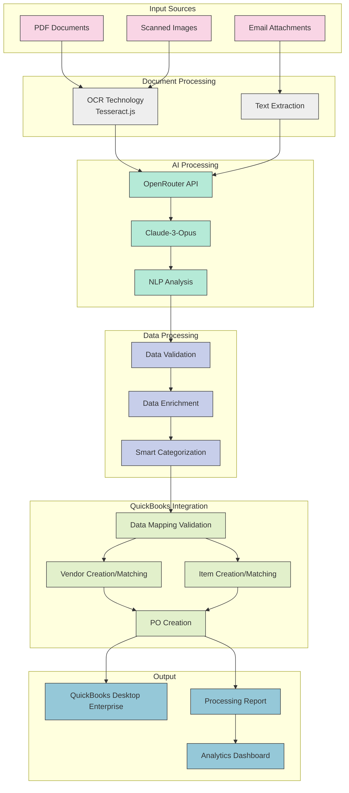

```mermaid
flowchart TD
    subgraph "Input Sources"
        PDF[PDF Documents]
        Email[Email Attachments]
        Scan[Scanned Images]
    end

    subgraph "Document Processing"
        OCR[OCR Technology\nTesseract.js]
        Text[Text Extraction]
    end

    subgraph "AI Processing"
        OR[OpenRouter API]
        Claude[Claude-3-Opus]
        NLP[NLP Analysis]
    end

    subgraph "Data Processing"
        Valid[Data Validation]
        Enrich[Data Enrichment]
        Cat[Smart Categorization]
    end

    subgraph "QuickBooks Integration"
        QBval[Data Mapping Validation]
        Vendor[Vendor Creation/Matching]
        Items[Item Creation/Matching]
        PO[PO Creation]
    end

    subgraph "Output"
        QB[QuickBooks Desktop Enterprise]
        Report[Processing Report]
        Dash[Analytics Dashboard]
    end

    PDF --> OCR
    Email --> Text
    Scan --> OCR
    OCR --> OR
    Text --> OR
    OR --> Claude
    Claude --> NLP
    NLP --> Valid
    Valid --> Enrich
    Enrich --> Cat
    Cat --> QBval
    QBval --> Vendor
    QBval --> Items
    Vendor --> PO
    Items --> PO
    PO --> QB
    PO --> Report
    Report --> Dash

    style PDF fill:#f9d5e5,stroke:#333,stroke-width:1px
    style Email fill:#f9d5e5,stroke:#333,stroke-width:1px
    style Scan fill:#f9d5e5,stroke:#333,stroke-width:1px
    
    style OCR fill:#eeeeee,stroke:#333,stroke-width:1px
    style Text fill:#eeeeee,stroke:#333,stroke-width:1px
    
    style OR fill:#b5ead7,stroke:#333,stroke-width:1px
    style Claude fill:#b5ead7,stroke:#333,stroke-width:1px
    style NLP fill:#b5ead7,stroke:#333,stroke-width:1px
    
    style Valid fill:#c7ceea,stroke:#333,stroke-width:1px
    style Enrich fill:#c7ceea,stroke:#333,stroke-width:1px
    style Cat fill:#c7ceea,stroke:#333,stroke-width:1px
    
    style QBval fill:#e2f0cb,stroke:#333,stroke-width:1px
    style Vendor fill:#e2f0cb,stroke:#333,stroke-width:1px
    style Items fill:#e2f0cb,stroke:#333,stroke-width:1px
    style PO fill:#e2f0cb,stroke:#333,stroke-width:1px
    
    style QB fill:#95c8d8,stroke:#333,stroke-width:1px
    style Report fill:#95c8d8,stroke:#333,stroke-width:1px
    style Dash fill:#95c8d8,stroke:#333,stroke-width:1px
``` 