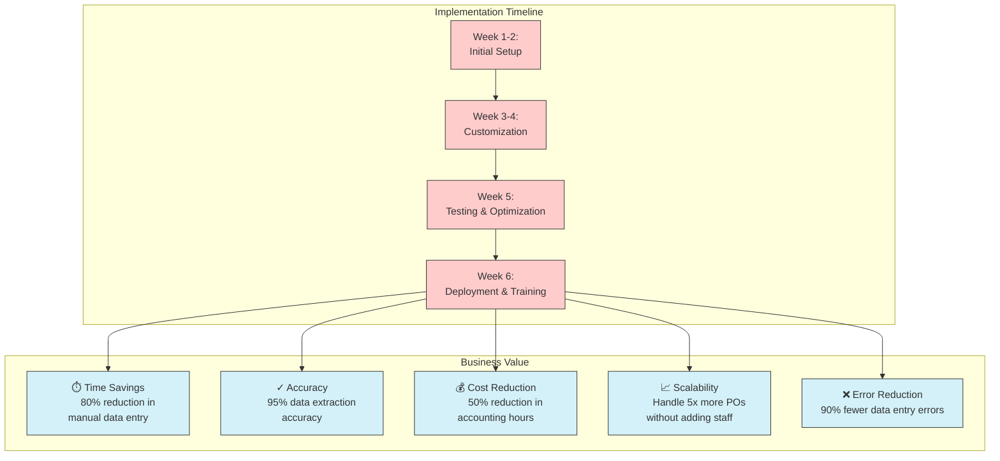

```mermaid
graph TD
    subgraph "Business Value"
        Time["⏱️ Time Savings
        80% reduction in manual data entry"]
        Acc["✓ Accuracy
        95% data extraction accuracy"]
        Cost["💰 Cost Reduction
        50% reduction in accounting hours"]
        Scale["📈 Scalability
        Handle 5x more POs without adding staff"]
        Error["❌ Error Reduction
        90% fewer data entry errors"]
    end
    
    subgraph "Implementation Timeline"
        Setup["Week 1-2:
        Initial Setup"]
        Custom["Week 3-4:
        Customization"]
        Test["Week 5:
        Testing & Optimization"]
        Deploy["Week 6:
        Deployment & Training"]
    end
    
    Setup --> Custom --> Test --> Deploy
    Deploy --> Time
    Deploy --> Acc
    Deploy --> Cost
    Deploy --> Scale
    Deploy --> Error
    
    style Time fill:#d4f1f9,stroke:#333,stroke-width:1px
    style Acc fill:#d4f1f9,stroke:#333,stroke-width:1px
    style Cost fill:#d4f1f9,stroke:#333,stroke-width:1px
    style Scale fill:#d4f1f9,stroke:#333,stroke-width:1px
    style Error fill:#d4f1f9,stroke:#333,stroke-width:1px
    
    style Setup fill:#ffcccc,stroke:#333,stroke-width:1px
    style Custom fill:#ffcccc,stroke:#333,stroke-width:1px
    style Test fill:#ffcccc,stroke:#333,stroke-width:1px
    style Deploy fill:#ffcccc,stroke:#333,stroke-width:1px
``` 