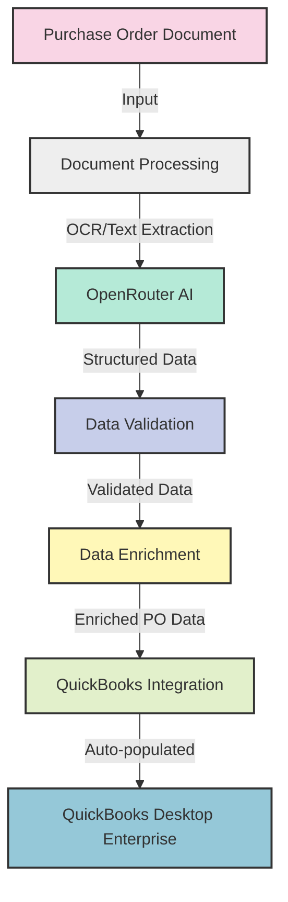

```mermaid
flowchart TD
    A[Purchase Order Document] -->|Input| B[Document Processing]
    B -->|OCR/Text Extraction| C[OpenRouter AI]
    C -->|Structured Data| D[Data Validation]
    D -->|Validated Data| E[Data Enrichment]
    E -->|Enriched PO Data| F[QuickBooks Integration]
    F -->|Auto-populated| G[QuickBooks Desktop Enterprise]
    
    style A fill:#f9d5e5,stroke:#333,stroke-width:2px
    style B fill:#eeeeee,stroke:#333,stroke-width:2px
    style C fill:#b5ead7,stroke:#333,stroke-width:2px
    style D fill:#c7ceea,stroke:#333,stroke-width:2px
    style E fill:#fff8b8,stroke:#333,stroke-width:2px
    style F fill:#e2f0cb,stroke:#333,stroke-width:2px
    style G fill:#95c8d8,stroke:#333,stroke-width:2px
``` 